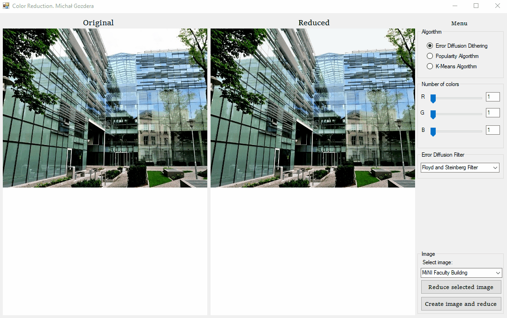
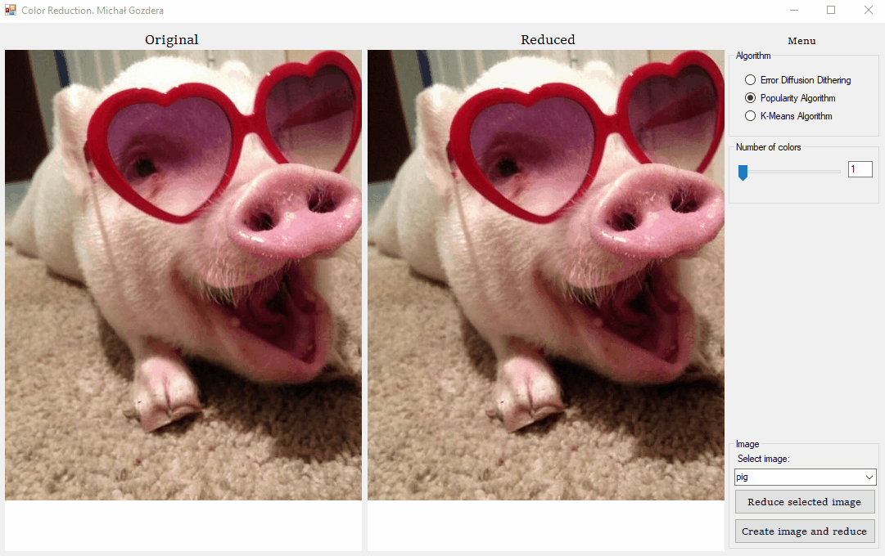
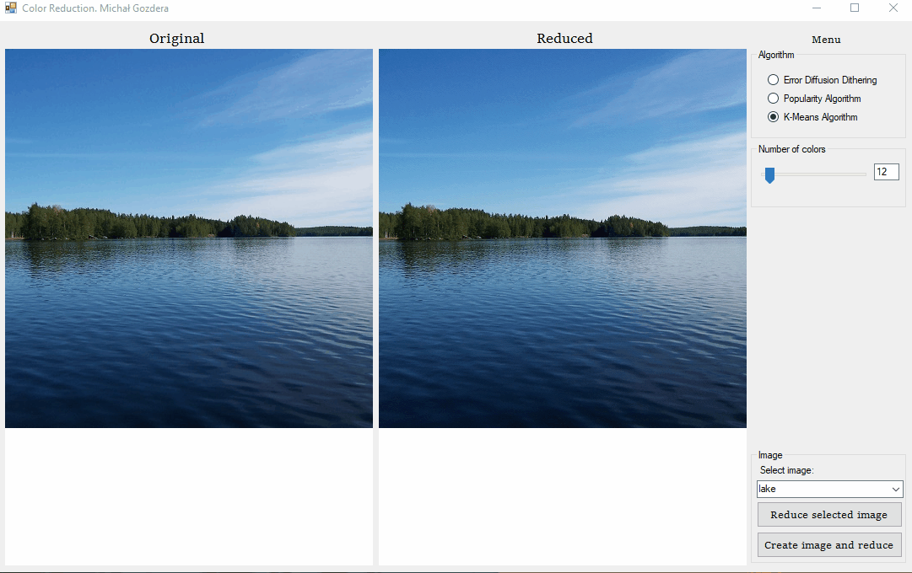
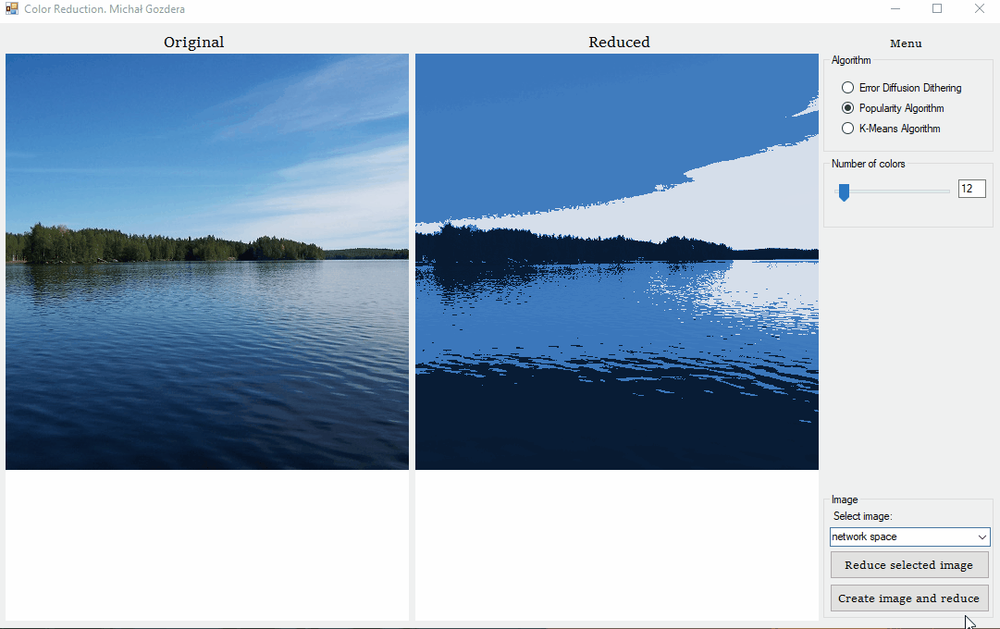

# ColorReduction
Image color reduction (color quantization) with three different algorithms: Error Diffusion Dithering, Popularity Algorithm, K-means Clustering. 

## Algorithms
With this app you can check and compare results of color quantization using three different algoritms.

## Examples of usage

### Error Diffusion Dithering

### Popularity Algorithm and Error Diffusion Dithering

### K-menas Clustering

### Popularity Algorithm and K-menas Clustering 

